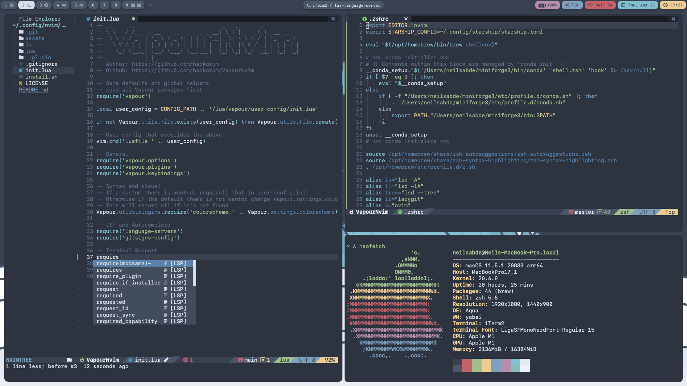

# My minimal dotfiles

Links to some stuff I use on my m1 mbp:
* [iTerm2](https://iterm2.com/) - Main Terminal
* [kitty](https://github.com/kovidgoyal/kitty/) - Secondary Terminal
* [simple-bar](https://simple-bar.com/en/) - Status Bar
* [spacebar](https://github.com/cmacrae/spacebar/) - Another Status Bar
* [skhd](https://github.com/koekeishiya/skhd/) - Simple Hotkey Daemon
* [yabai](https://github.com/xorpse/yabai/) - Window Manager
* [starship](https://starship.rs/) - Shell Prompt
* [zsh](https://www.zsh.org/) - Shell
* [neovim](https://neovim.io/) - Main Text Editor
* [Visual Studio Code](https://code.visualstudio.com/) - Backup IDE
* [Liga SF Mono Nerd Font](https://github.com/shaunsingh/SFMono-Nerd-Font-Ligaturized/) - Font
* [Wallpaper](wallpaper.jpg)

### Where is my neovim config?
I have a pre-configured neovim setup called VapourNvim. You can find it [here](https://github.com/hackorum/VapourNvim/).
